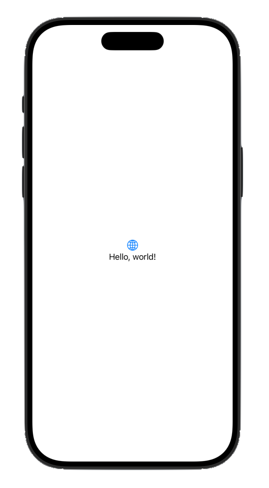

#  swiftui 

####  [hello world](https://developer.apple.com/tutorials/develop-in-swift/hello-swiftui)

introduction on xcode, swift, and swiftui.  in the first project, chat prototype, you'll code a chat conversation using text views.  the text and colors in the project are just suggestions, so feel free to make it your own by changing the words and styles.

##  section 01 create a new project

 

####  `ContentView.swift`

```swift
import SwiftUI

struct ContentView: View {
    var body: some View {
        VStack {
            Image(systemName: "globe")
                .imageScale(.large)
                .foregroundStyle(.tint)
            Text("Hello, world!")
        }
        .padding()
    }
}

#Preview {
    ContentView()
}
```